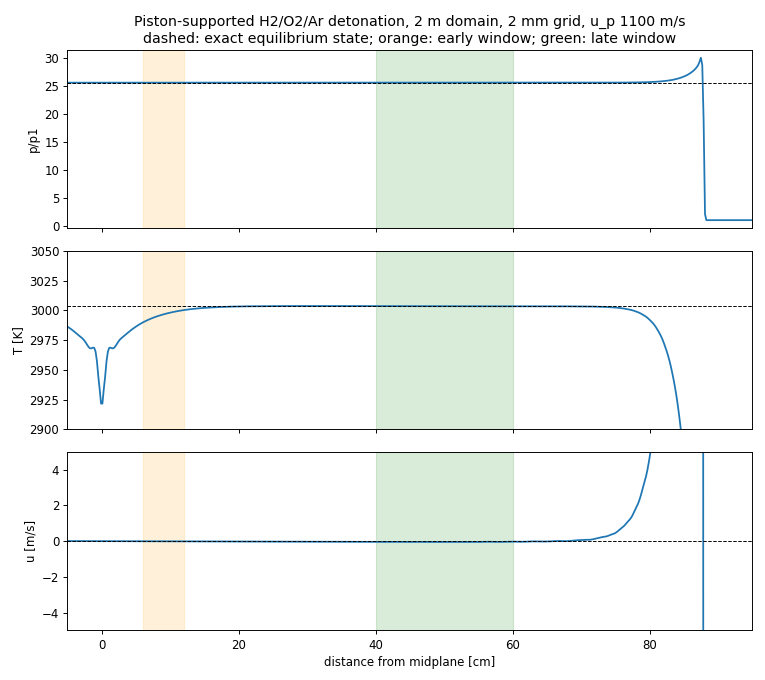

# Reacting flow: Strang coupling and detonation verification

Item 4, third piece (2026-09-30). It joins the stiff reaction integrator (`docs/evidence/REACTION_VERIFICATION.md`)
to the multi-species core (`docs/evidence/MIXTURE_CORE.md`). TECHNICAL_PLAN: "Begin with documented
symmetric reaction/transport splitting and stiff reaction integration; measure splitting error."

## What exists

- `adapters/reacting_flow.hpp/.cpp`: `ReactingFlow(flow, mechanism, threads)`.
  - One step is half a reaction step, one flow step, then half a reaction step (Strang splitting).
  - Reaction runs per cell at fixed density and total energy. It uses the closed, adiabatic,
    constant-volume CVODES parcel, already verified against Cantera's ReactorNet.
  - Each worker thread owns its own Cantera context. Cells are split into contiguous blocks, and
    each cell's result does not depend on the partition.
  - The constructor checks that the flow's medium is the mechanism's species, in order, with
    identical NASA coefficients.
  - **Symmetry is kept exactly.** The first half reaction step heats the gas, which raises the sound
    speed and lowers the flow's CFL limit. The step therefore re-plans:
    - save the partial densities;
    - react half the step;
    - if `stableDt()` is now below the planned step, restore and redo the half step with the
      shorter one;
    - only then take the flow step.

    Before this fix, 1510 of 1513 steps had reaction halves that did not match the flow step.
    Now 0 of every run's steps are asymmetric (`Stats::asymmetricSteps`).
  - Cost: nearly every step re-plans once, so about a third more reaction work. A predictor for
    the heated sound speed would remove most of it. That is an efficiency item, not a correctness one.
- `core/flow`: `setPartialDensities` restores saved species (bulk state unchanged).
- `tests/detonation_study.cpp`: `crucible_detonation_study <cells> <cfl> <threads> <u_p> <length>`.
  This is a study, not a ctest. Runs take 20 s to 11 min.

## The check: piston-supported (overdriven) detonation

- Mixture: 2H2 + O2 + 7Ar (h2o2.yaml) at 298 K and 6.67 kPa.
- Setup: reactants at +u_p on the left half and −u_p on the right half collide at the midplane.
  - By symmetry the midplane is a wall, which is a piston at u_p in the burned-gas frame.
  - The collision shock ignites the gas, so there is no driver or initiation input.
- **Exact solution** (computed in the test from Cantera equilibrium, independent of the flow solver):
  - The burned gas comes to rest in uniform equilibrium.
  - Mass and momentum across the wave give u_p = D(1 − v2/v1) on the equilibrium Hugoniot
    e2 − e1 = ½(p1 + p2)(v1 − v2), with D = v1·sqrt((p2 − p1)/(v1 − v2)).
  - For u_p = 1100 m/s (u_CJ = 714.5 m/s):
    - D = 1755.94 m/s (overdrive (D/D_CJ)² = 1.179);
    - lab front speed D − u_p = 655.94 m/s;
    - T2 = 3003.2 K, p2/p1 = 25.609.
  - Cross-check: CJ from the same code is D_CJ = 1616.9 m/s, T 2802 K, p/p1 15.72. The standard
    value for this mixture is about 1618 m/s.
- **Tolerance, written before the first piston run:** front speed within 1%.
- **Measurement:**
  - Front: the interpolated crossing of p = 10 p1.
  - Speed: least-squares fit of the front position against time once the front is 40–88% of the
    half-length from the midplane. The two halves of that window are also reported.
  - The first version used the whole-cell index. The resulting staircase aliased the fit by a few
    tenths of a percent and was replaced.

### Results (all measured; `docs/evidence/detonation_verification_2026-09-30.txt`)

Front speed error against the exact 655.94 m/s:

| domain | dx | CFL | whole window | first half | second half |
|---|---|---|---|---|---|
| 0.5 m | 2 mm | 0.4 | −0.424% | −1.006% | +0.022% |
| 0.5 m | 1 mm | 0.4 | −0.427% | −1.011% | +0.016% |
| 0.5 m | 0.5 mm | 0.4 | −0.395% | −0.939% | +0.018% |
| 1 m | 4 mm | 0.4 | +0.236% | +0.229% | +0.231% |
| 1 m | 2 mm | 0.4 | +0.224% | +0.227% | +0.209% |
| 1 m | 2 mm | 0.2 | +0.225% | +0.227% | +0.209% |
| 1 m | 1 mm | 0.4 | +0.219% | +0.220% | +0.202% |
| 1 m | 0.5 mm | 0.4 | +0.213% | +0.217% | +0.194% |
| 2 m | 4 mm | 0.4 | +0.096% | +0.146% | +0.056% |
| 2 m | 2 mm | 0.4 | +0.085% | +0.130% | +0.048% |

- **Pass:** every run is inside 1%.
- **Grid:** on the 1 m domain, going from 4 mm to 0.5 mm moves the speed by 0.023 percentage
  points, falling about 0.005 per halving.
- **Time step, including splitting:** halving the CFL moves it by 0.0005 percentage points.
- **What remains is a start-up transient** of the reacting Euler equations, not discretisation
  error. It changes with how far the wave has travelled and not with dx or dt:
  - slow by about 1% at 0.1–0.16 m from the midplane;
  - fast by 0.2% around 0.2–0.44 m;
  - +0.05% at 0.64–0.88 m.

  This mixture's slow three-body recombination gives a reaction zone about 15 cm long behind the
  front (see the figure), so the overdriven wave settles over tens of reaction-zone transits.

Burned plateau against the exact equilibrium state (T2 3003.2 K, p2, u = 0):

| window | domain, dx | T | p | u |
|---|---|---|---|---|
| late (40–60% of the half-length) | 2 m, 2 mm | +0.006% | −0.009% | −0.04 m/s |
| late | 1 m, 0.5 mm | +0.006% | +0.039% | 0.45 m/s |
| early (6–12 cm) | 2 m, 2 mm | −0.24% | −0.01% | −0.02 m/s |

- Each burned parcel keeps the entropy of the shock that burned it.
- Gas burned during the steady phase sits on the exact state.
- Gas near the midplane carries the start-up history:
  - the first gas was shocked inert and then burned at constant volume, about 70 K cooler,
    within 2 cm of the midplane;
  - the early front was about 1% slow.

  So in the early window the pressure is exact but T is 0.24% low.
- The plateau windows were chosen after viewing the 2 mm field.

Other measured quantities:
- |T_chemistry − T_core| after every reaction substep is at most 1.5e-6 K.
- Mass and energy balance errors are about 1e-14.
- No flow-step rejections occurred.

## Reported only: unsupported (CJ) wave

- Setup: driver-initiated (first 2 cm at 3000 K and 40 p1, same reactants), 0.5 m domain, fit
  over 0.30–0.45 m, compared with D_CJ.
- Front speed: −9.8% at 2 mm and −6.5% at 0.5 mm. These used the old whole-cell front measure.
- This is not a clean check:
  - Heat released behind the sonic point cannot support the front.
  - In this mixture about a quarter of the heat release (H2O mass fraction 0.067 → 0.088) arrives
    over the following 20 cm while the gas is already expanding.
  - So at 0.45 m the deficit mixes physics (slow approach to CJ) with resolution.
- A weaker driver (1 cm, 2500 K, 30 p1) failed to initiate on a 1 mm grid. It gave a decoupled
  shock at about 1100 m/s that re-ignited after 0.15 m.

## Limits

- 1-D and inviscid only: no transport, no cellular structure. Transverse instability needs 2-D and
  much finer grids. It is not needed for the rocket chamber, where combustion is deflagration.
- The fit window and plateau windows are measurement choices. The figure shows why each was chosen.
- The mechanism is the h2o2.yaml shipped with Cantera.
